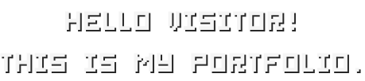

<h1 align="center">
	
</h1>

Here I show some of my projects I am working on in my freetime. This includes my work in mostly these areas:
- 🌐 Web Development
- 🕹️ Game Development
- 🎵 Music Creation

## 

The portfolio features an interactive music player, which you can use to directly listen to the music I created. The system is done with a combination of the **[Web Audio API](https://developer.mozilla.org/en-US/docs/Web/API/Web_Audio_API)** and **[SolidJS Components](https://www.solidjs.com/docs/latest/api)**.

## 

You can visit this portfolio at **[https://portfolio.hum22501.webspace.spengergasse.at/](https://portfolio.hum22501.webspace.spengergasse.at/)**. This is the link to the live version of this portfolio hosted on an easyname webserver. (I do also plan to add a real domain name to this website in the future.)

## 

If you want to run this portfolio locally, you can do so by following these steps:

1. Clone this repository
2. Run `npm install` to install all dependencies
3. Run `npm run dev` to start the development server
4. Dependent on the configuration, you can now visit the website at **[http://localhost:3000](http://localhost:3000)**