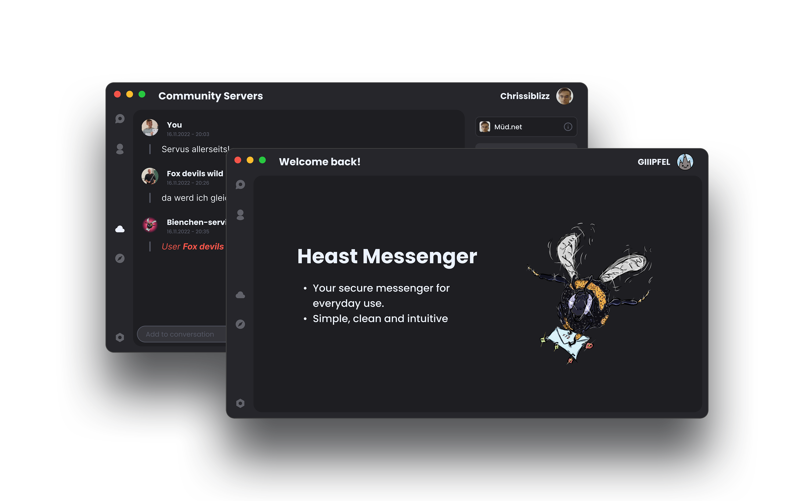

# Heast Messenger

Heast is a secure, community-driven messenger service written fully in dotNet/C#. 
It's based on decentralised, optionally self-hosted servers for your friends and family to hang out together.

The idea for this project came to me and a friend of mine when we were looking on how to create online networks in java.
We first thought of creating a multiplayer game, but then we decided to create a messenger service instead.

The project is fully documented on our [gitbook page](https://heast.gitbook.io/docs/)

