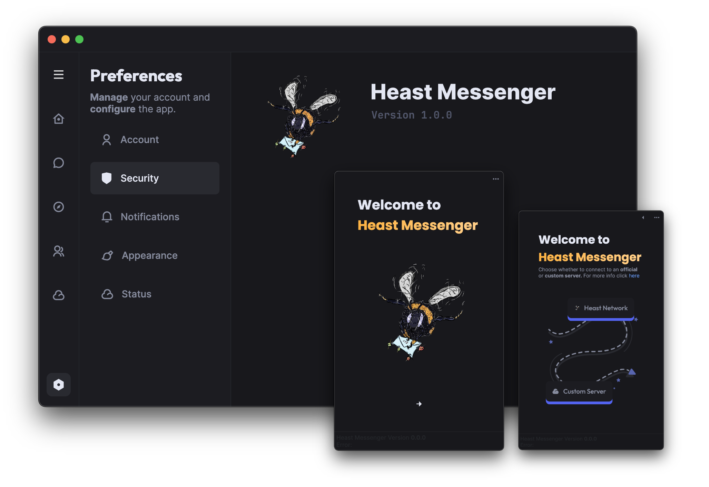

# Heast Messenger (C#)

C# offered way more possibilities like better cross-platform compatibility, generating source code for speeding up development, an overall improved ecosystem in contrast to Java (in my opinion) and mainly the opportunities to create fast, and good looking user interfaces.

Both the client and server were completely rewritten from scratch using Avalonia for the frontend and DotNetty, a port of Netty in C#, for the backend. For a detailled documentation, I recommend reading the [GitBook](https://heast.gitbook.io/docs/).

To get a glimpse about how the server has evolved, it has a clean and customizable command line interface:

## More about the server

The server was split into an authentication server and a messaging server to further push the idea of a decentralized social network, where the authenticator would only handle things regarding security and permissions, whereas the messaging server is there to, well, actually handle real-time messaging between different clients.

Suppose one wants to create a custom server, they are given the freedom to choose between hosting their own auth-server or using the official Heast authenticator with added benefits.

By using a custom messaging server in combination with the official Heast authentication network allows people to use the same *official* account across all officially authenticated servers, including your own. This makes it easier for other people to join your server and guarantees them a specific privacy and security standard that we, the official Heast team, offers like end-to-end encryption and safe account credential management.

For maximum isolation and freedom you are also given the option to host your own authentication server. This means you are in full control of everything that happens on the server and it's completely up to you whether you add your own privacy standards or possibly spy on your members by inspecting their account credentials *(I really hope you don't do that)*. **YOU** get to manage how your members are managed and Heast does not provide any services to you.
