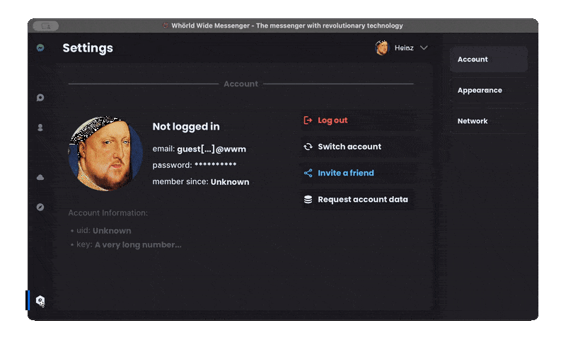

# Whörld Wide Messenger

We began creating the first iteration of the program in June 2022, where it was still named Whörld-Wide-Messenger (contains an old reference to a funny teacher back in highschool). We started off with a primitive Kotlin/JavaFX client and a Java server that supported basic messaging via packets.

The screenshot at the top is already a later stage in development where I used JavaFX' styling engine and animation system to create a pretty good looking UI, however it wasn't really functional at that point.

As the project grew, we had to move it to its [own GitHub organization](https://github.com/Heast-Messenger), as the code was hosted on my friends personal [repository](https://github.com/m-ue-d/Wh-oe-rldWideMessenger). We also needed to come up with a name that truly fit the software's intention, namely being a social messenger. That's when another friend of mine came up with *Heast* - a very common Austrian term for impolitely telling someone to listen, which makes sense in a way that is connected to a messenger app.
