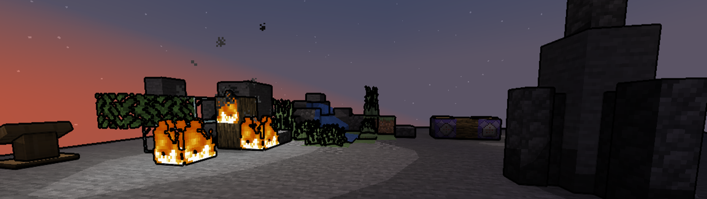

[//]: # (VITE_GENERATION_INDEX: 2)

# Attempt Nr. 3: Back to Minecraft

After breaking up with Unity, I decided to go back to my roots and start a new project in Minecraft. Four major versions later and Minecraft has evolved greatly, with many new possibilities and features that I can use to create my game.

I decided to ditch the modded aspect of Sky's Horizon requiring Optifine or Iris to use beautiful shaders, and rather go for a vanilla shader pack that is available for everyone to use. As seen in the screenshot, I went for a stylised look inspired by Lethal Company by abusing posterization and thick outlines.

Well, I reminded myself of the first time I tried creating the game in Minecraft and remembered the many limitations that I had to face. I wanted to create the game in my pace and not being forced to wait for important updates to be released to implement features that I need. Furthermore, I have a distinct art style in mind that I want the game to have, namely procedural, polygonal terrain, which is not possible in Minecraft's blocky world.