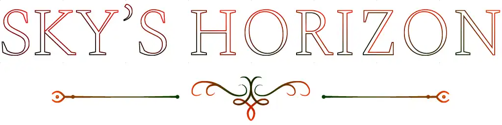

# Animated Logo

During the last sequence of the introduction movie, the player flies far away with their spaceship and continously accelerates. Next to a heavy camera shake effect - which is by the way described [here](/#/book/skys-horizon/devlogs/camera-shake.md) - the screen slowly fades to a fully white screen. Then, the game's logo should fade in with a nice SVG-path-like animation.

## Experimenting with Shader-driven Animations

Initially, I planned on using a dynamic-fill animation for the text, but it lead to issues later during correctly exporting the image. Nevertheless, I still experimented with the shader implementation and the way the image is encoded to correctly display it in game:

 The base texture uses a 16-bit grayscale + alpha gradient to store the necessary timing information and is converted to an 8-bit rgba image (blue channel is always empty) before displaying it in game. The tool for conversion is pretty straightforward and converts each individual grayscale pixel into the respective red and green values. In the shader, these values are interpreted as a single 16-bit value and are compared to the current game time.
 
 For actually showing the image in Minecraft I am using the `/title` command together with a custom unicode font that shows a collection of 256×256 pixel images that are correctly shifted in place with negative spaces to result in the final image.

 ## Applying this Technique to the actual Logo

Turns out this is harder than I initially thought, because all the tools I tried each have their ups and downs, but can't do all tasks I need them to do. See, the logo consists of elements with thin lines and a small drawing below it that should be animated along their path. For a smooth transition I *(initially thought)* I also need the 16-bit color depth, but these are mutually exclusive between Canvas Affinity and Adobe Illustrator. I also tried alternatives like Gimp, but these were far worse, even for general painting tasks.

In the end, I still opted for Illustrator, because it supports gradients along paths and it seems like the reduced 8-bit color depth is negligible for my logo animation. The limit of 256 frames is only limited to each letter individually, because I am using a different color channel to offset the entire animation's time for different parts of the logo:

*(greener parts are faded-in later than blacker parts)*

In-game, it looks like this, and I think it turned out great! *(and it's soooo smoooth!)*

---

I probably overengineered this feature, but I still think it's worth it, considering the cutscene is really important, as it's the transition between the introduction movie and the actual game (shortly after the crash-scene).