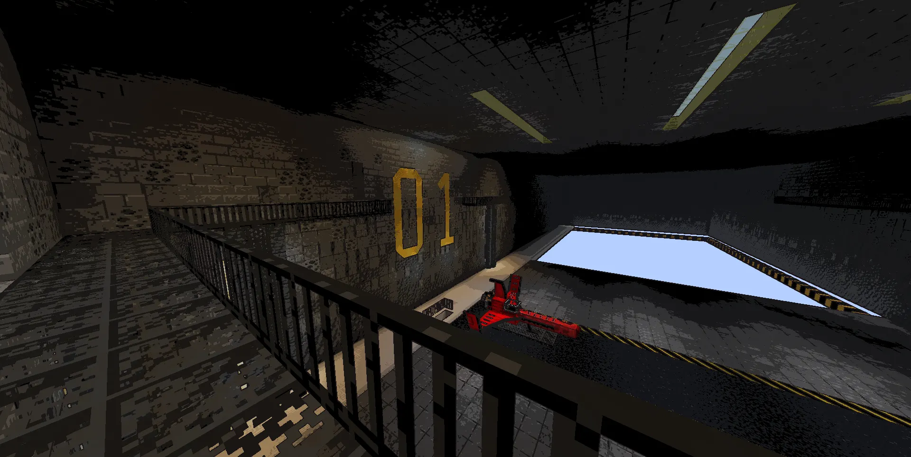

# Spaceship Hangar

The past few days I have been working on the spaceship hangar for Sky's Horizon, as I needed a break from programming and wanted to try out something new.

This may sound odd, but I actually have never built any structure like this hangar before, neither for a game of mine, nor just for fun (e.g. in Minecraft survival mode.), so it felt just like a refreshing breeze.

First, i started building the basic outline, floor and walls all by hand, but I quicly noticed that this repetetive building was way too time consuming. Coming from a development background, I did know how to use basic building commands provided by Minecraft such as `/fill` and `/clone`, but they were way too primitive and rather hindered real progress.

Only later in the process I remembered the existence of this one awesome tool called **Axiom**, which would soon carry most of the heavy duty of building.

Besides from building the hangar, I also played around with post processing shaders using the transparency shader, which essentially abuses Minecraft's faboulous graphics option to hook into the shader pipeline during the final rendering phase.

One *could* argue that the style looks very similar to the stylized effects found in games like *Lethal Company*, and well... *that's because it does*. I love how posterization and thick outlines simplify the composition and it really gives off that *~ vibe ~* I'm chasing for Sky's Horizon. Additionally, it helps reduce workload on custom item- and block textures, as I don't have to carefully pick each pixel's color, saturation and brightness. They get compressed anyways.