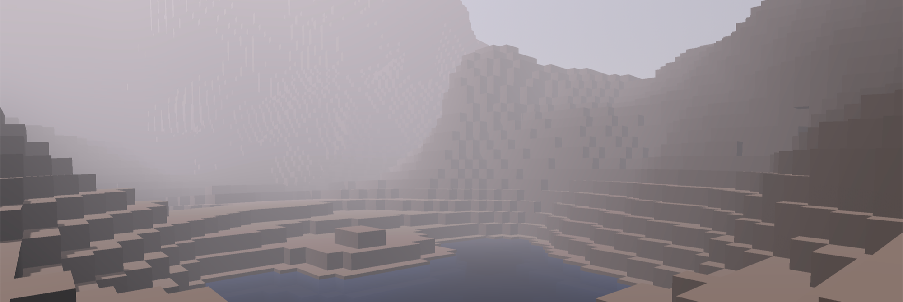

[//]: # (VITE_GENERATION_INDEX: 3)

# Attempt Nr. 4: Godot

After the failure of the Minecraft project, I decided to try out Godot, a free and open-source game engine that is easy to use and has a lot many of the features that Unity is missing.

The screenshot shows the first experiments with the terrain addon, but it looks more like Minecraft currently and not like the visions I have in mind for Sky's Horizon.

Using Godot has been a pleasant experience so far and a nice change from Unity. Godot really feels like a game engine and not just a graphics engine like Unity.