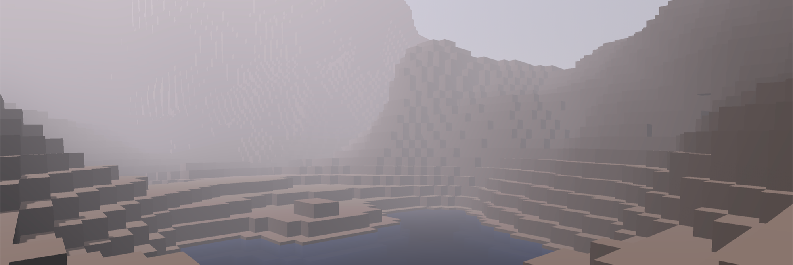

# Attempt Nr. 4: Godot

After the failure of the Minecraft project, I decided to try out Godot, a free and open-source game engine that is easy to use and has a lot many of the features that Unity is missing. I love the data driven design of Godot which makes working with resources much easier than with Unity's scriptable objects and also adore how the resources in Godot directly translate and reflect to C# / GDScript classes, which is so much better for actual game development.

The screenshot shows the first experiments with the terrain addon, but it looks more like Minecraft currently and not like the visions I have in mind for Sky's Horizon. I tried to fix the system myself, but it was in a really poor state and not well-developed, so I had to scrap it later in the process.

Despite Godot's major benefits in contrast to Unity, it still has some flaws I could not get around. It probably is my own fault for not taking the time to actually get good working in a game engine, as something like this can take years to master. Like the first time I have switches back to using Minecraft, the Mojang has, again, greatly improved the game since the last few months / years and I like how Minecraft gets more and more customizable and scriptable through a similar data driven design, which makes it a great candidate for a game engine and the ideal playground for my needs.