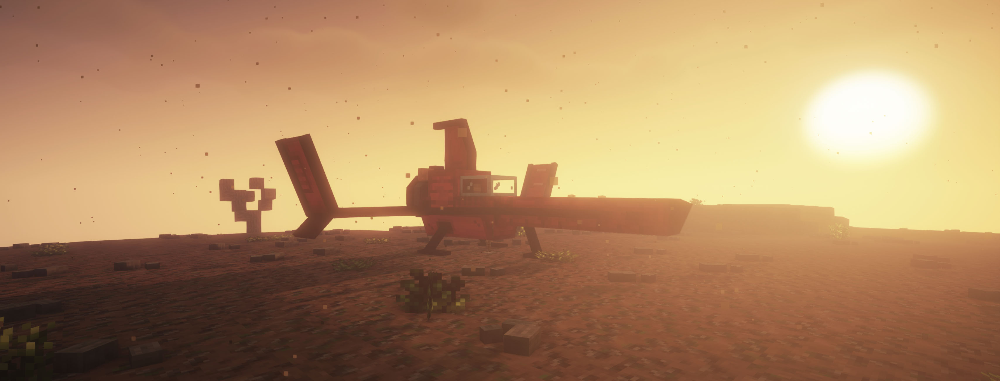

[//]: # (VITE_GENERATION_INDEX: 0)

# Attempt Nr. 1: Minecraft

When the idea of the game came to my mind, everything started with Minecraft. Why? Because it's a game that I know pretty well from the inside out and knew how to develop my own game using Minecraft more like a game engine. The main issue with this approach was that I had to heavily rely on Minecraft's limitations and often had to work around them with the constant cat and mouse game of keeping the game performant and feature-rich.

I had been making lots of datapacks for Minecraft and added many custom features to the game. I liked the idea of not having to install a custom mod loader to play with custom features and I became very familiar with Minecraft commands and their capabilities.

Minecraft had a lot to offer. Custom dimensions, world generation, a 3D viewport with a good player controller and a lot of other features that I could use for Sky's Horizon without having to implement them myself.

As seen in the screenshot, this is the farthest I got with the game using Minecraft. The spaceship is a custom model that I made in Blockbench and has a fully working flying system.